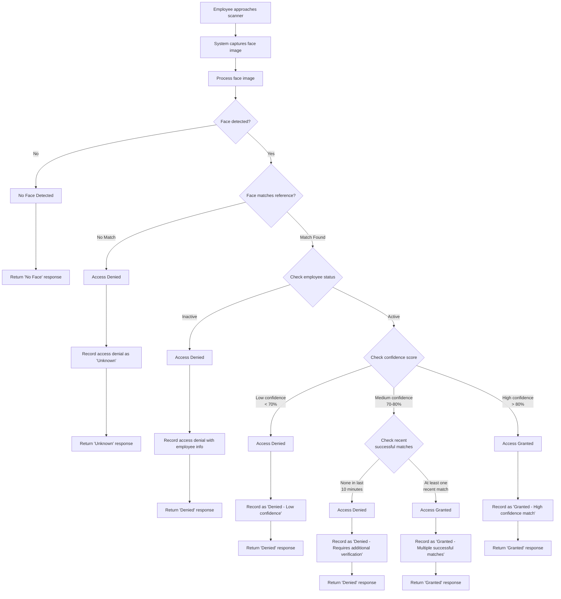

## Face Recognition Access Control System Flowchart

This flowchart represents the actual implementation of the face recognition access control system. Note that the system determines access permission but does not physically control any door hardware.

The system:
1. Captures and processes face images
2. Matches faces against stored references
3. Checks employee status (active/inactive)
4. Evaluates match confidence levels
5. Records all access attempts
6. Returns appropriate responses

For high confidence matches with active employees, the system returns a "Granted" response, but the implementation of the physical access control (e.g., door unlocking) would require separate integration. 